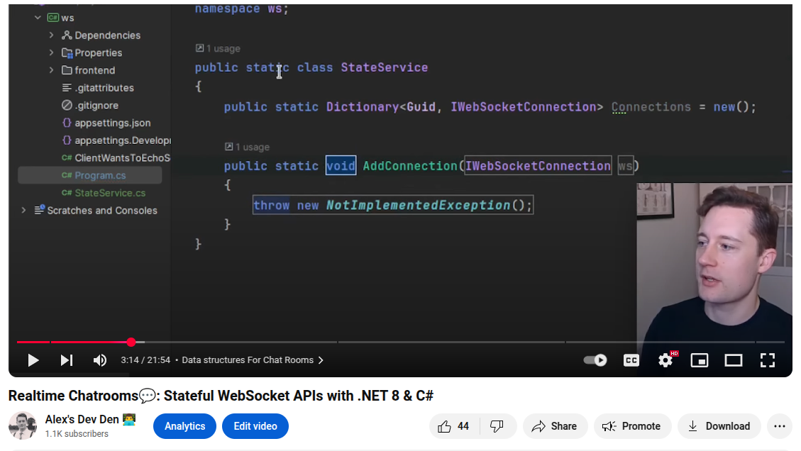
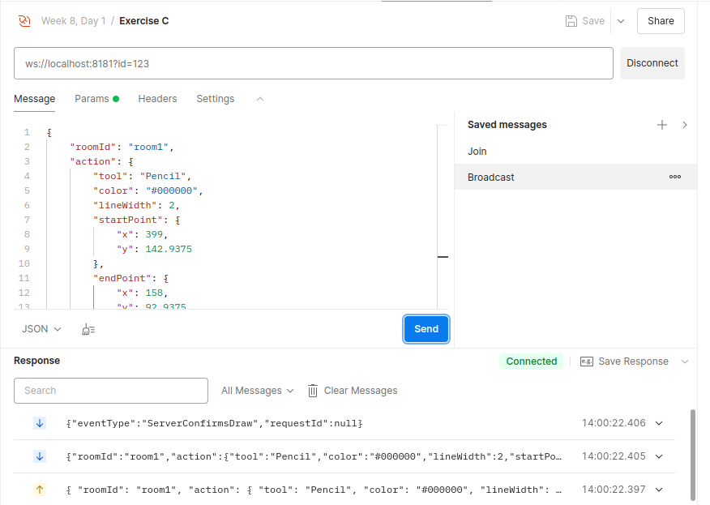

# Basic WebSocket Connection Management with Dictionaries


*(+ Internship Info Meeting with Jesper Ottosen at 9 o'clock)*

Connection management is a difficult subject, so we will ease into it by doing today's content with C# Dictionaries, and make it more scalable next time using Redis.

Today's video shows basic demonstration:

LINK: `https://www.youtube.com/watch?v=uWpmjxv5_6g`


#### Remote repo for today's lesson: `https://github.com/uldahlalex/fs25_8_1` 
*(Exercise C solution combines all content and is also demontrated with a react gui during lesson)*

### Agenda

- 08:15: Presentation
- 09:00: Internship Info Meeting
- 10:00 -> 11:30 Tons of fun with dictionaries

### Topics:

- WebSocket Connection Management and relevant data structures

### Exercises


<!-- #region ex A -->

<details>
    <summary>Adding and removing connections</summary>


<div style="margin: 20px; padding: 5px;  box-shadow: 10px 10px 10px grey;">

## Task:
When clients connect to the API, store the IWebSocktConnection in a dictionary. If they disconnect, remove them from the dictionary.

**It is preferable to use a ConcurrentDictionary<Key, Value> due to its thread-safety rather than a plain "Dictionary<Key, Value>".**

</div>
</details>

<!-- #endregion ex A -->

_______


<!-- #region ex B -->

<details>
 <summary>Subscribing, unsubscribing and broadcasting</summary>

<div style="margin: 20px; padding: 5px;  box-shadow: 10px 10px 10px grey;">


## Task

Make a dictionary which keeps track of "topic IDs"(key) and a list OR hashset of the socket ID's subscribed to the topic (value).

It is common practice to **also** make a "reverse looup" dictionary which instead uses the connection as a key and list of topics the connection is subscribed to as a value. 

It should be possible for two clients to:
- Connect to the API
- Join a topic (could be something as typical as a "game-room", "receive notifications from X device", etc )
- Broadcast to all members of a topic

</div>
</details>

<!-- #endregion ex B -->

_______


<!-- #region ex C -->

<details>
 <summary>Client ID's vs Socket ID's</summary>

<div style="margin: 20px; padding: 5px;  box-shadow: 10px 10px 10px grey;">


## Task

Connect to the WebSocket API, but instead of only using the generated Socket ID, give the client a unique connection ID from the address query param which can be assigned when connection (example from postman with ?id=123):



Use this in your code. I use a "ConnectionManager" class instance (manager) in this example: (Full code in Exercise C solution)

```csharp
server.Start(socket =>
        {
            var queryString = socket.ConnectionInfo.Path.Split('?').Length > 1
                ? socket.ConnectionInfo.Path.Split('?')[1]
                : "";

            var id = HttpUtility.ParseQueryString(queryString)["id"];

            socket.OnOpen = () => manager.OnOpen(socket, id);
            socket.OnClose = () => manager.OnClose(socket, id);
```


You should have the following dictionaries which is the foundational data structures for almost any topic/subcription setup:

```csharp
    public ConcurrentDictionary<string /* Client ID */, IWebSocketConnection> ConnectionIdToSocket { get; } = new();
    public ConcurrentDictionary<string /* Socket ID */, string /* Client ID */> SocketToConnectionId { get; } = new();
    public ConcurrentDictionary<string, HashSet<string>> TopicMembers { get; set; } = new();
    public ConcurrentDictionary<string, HashSet<string>> MemberTopics { get; set; } = new();
```

Use this approach to lookup by a client's connection ID instead of the socket ID (which change every time the client reconnects). Now make something cool using topics & subscriptions (multi-client of course)

</div>
</details>

<!-- #endregion ex C -->

_______

