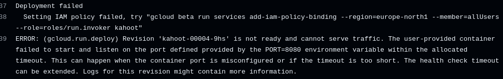
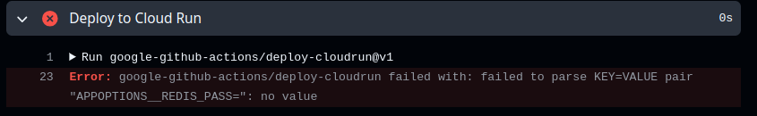
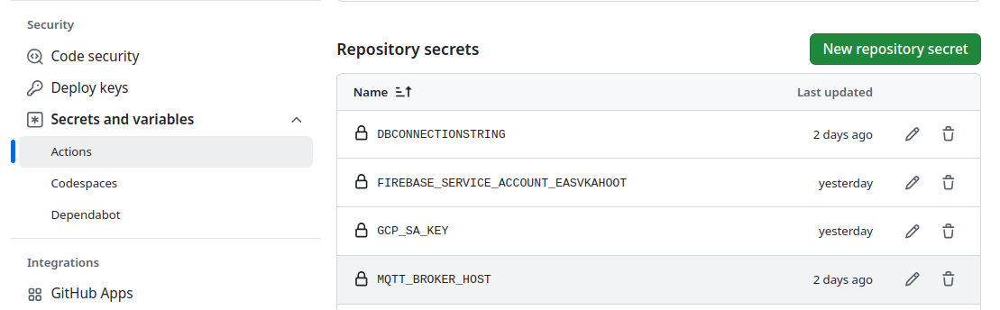
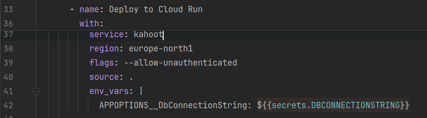

## Deployment


### Common problems:


#### Policy problem:



Solution: Here you can simply copy the command it gives you and execute in a terminal with the gcloud CLI installed.

In my case it is:

```
gcloud beta run services add-iam-policy-binding --region=europe-north1 --member=allUsers --role=roles/run.invoker kahoot 
```

#### An environment variable isn't properly configured



Solution:
- Set the repository secret in settings page with a capitalized secret name.
- In your workflow make an environment variable prefixed with APPOPTIONS__{whatever you call it} (yes, that is 2 underscores)
Like this.


